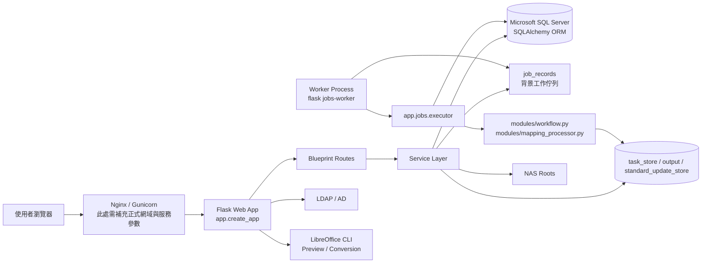
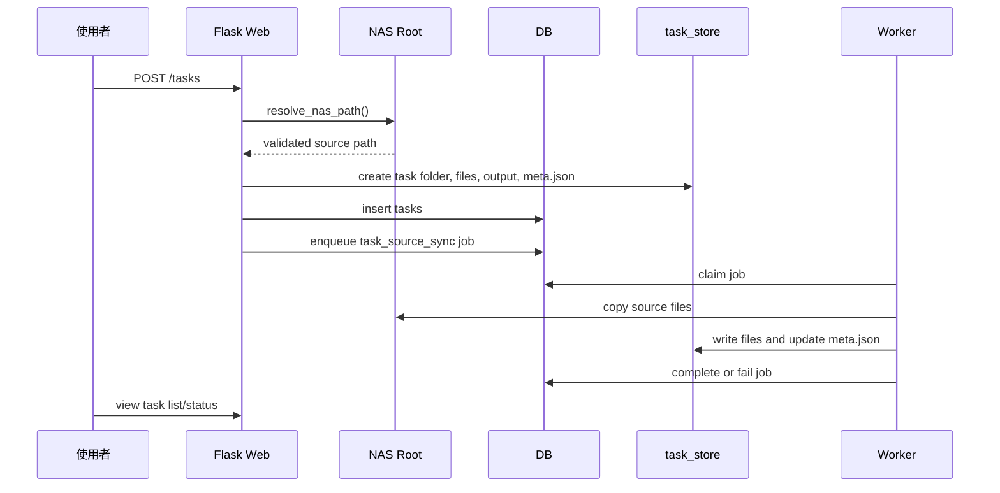
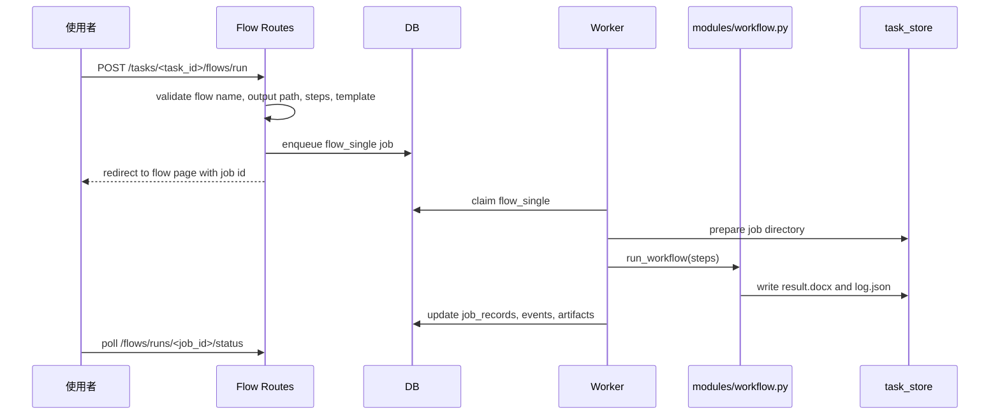
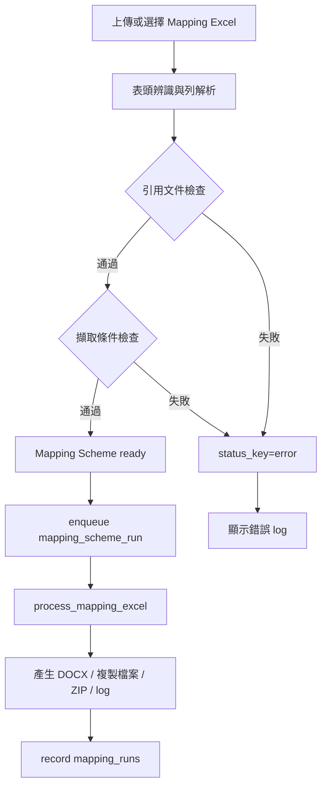
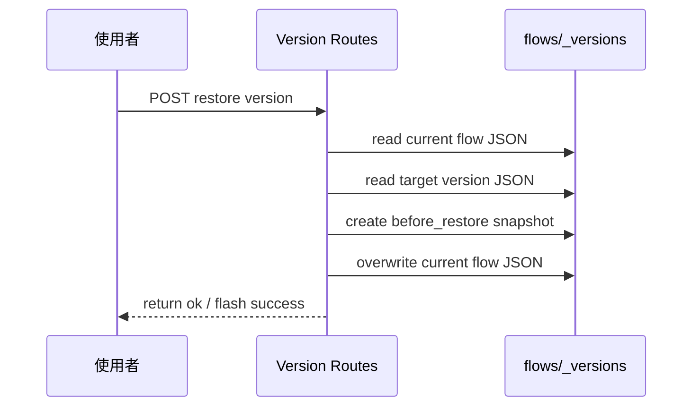
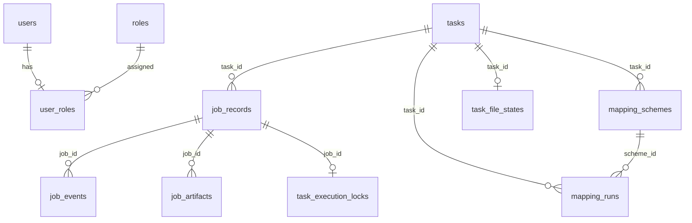

# 附錄 C. 系統圖與流程圖

## 主要依據檔案

- `SYSTEM_ARCHITECTURE.md`
- `app/__init__.py`
- `app/services/execution_service.py`
- `app/services/task_service.py`
- `app/services/flow_version_service.py`
- `modules/workflow.py`
- `modules/mapping_processor.py`
- `app/models/*`

## 系統架構圖

## 任務匯入與來源同步流程

## 流程執行流程

## Mapping 檢查與執行流程

## 流程版本回復流程

## ERD 摘要

備註：除 `users`、`roles`、`user_roles` 外，多數關聯為程式邏輯關聯，ORM 未定義實體外鍵。

## 待補充項目

- 此處需補充正式部署拓撲圖與網路邊界。
- 此處需補充完整 ERD 圖與資料表群組分類。

