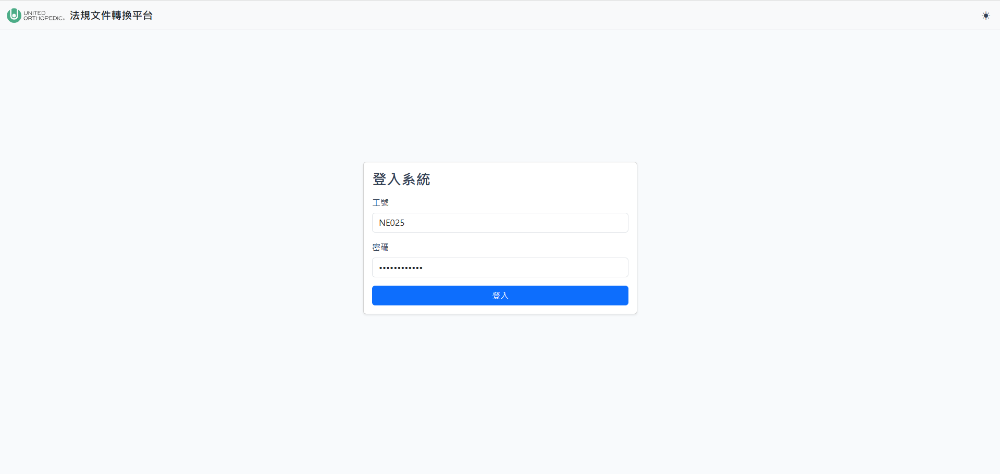

# 使用者操作手冊

## 1. 系統概述

本系統為「法規文件轉換平台」，提供使用者以瀏覽器建立文件轉換任務、同步 NAS 來源檔案、定義並執行文件處理流程、管理輸出結果，以及執行標準更新作業。依目前專案檔案確認，系統主要入口包含「文件轉換」與「標準更新」兩大功能，並提供排程中心與管理後台供批次執行、帳號權限、系統設定、操作紀錄與錯誤紀錄管理使用。

主要使用者包含一般編輯者與系統管理者。編輯者可建立與操作文件轉換任務、流程、Mapping、標準更新任務與批次排程；系統管理者另可進入 `/admin` 管理使用者、查詢 AD 帳號、調整系統設定、檢視操作紀錄與系統錯誤紀錄。

資料流程依程式碼推測如下：使用者先建立任務並指定 NAS 存取路徑，系統將來源檔案同步至任務工作區；使用者在任務中建立流程或 Mapping 設定，送出後由背景工作佇列執行；完成後可於結果頁或輸出存放空間下載 Word、ZIP、Log 或 Excel 等檔案。

此處建議補充畫面截圖：功能入口頁。

## 2. 系統使用前準備

使用者需具備下列條件：

| 項目 | 說明 |
| --- | --- |
| 瀏覽器 | 此處需補充正式支援的瀏覽器版本。系統畫面為伺服器渲染 HTML，需支援現代 JavaScript 與 Bootstrap 互動元件。 |
| 使用者帳號 | 需由管理者授權於系統使用者清單中；登入驗證使用 LDAP / AD。 |
| NAS 存取 | 建立文件轉換任務時需選擇或輸入允許範圍內的 NAS 資料夾。 |
| 來源檔案 | 文件轉換流程主要使用任務工作區內檔案；標準更新需上傳 Word 與 Excel 檔案。 |
| 權限 | 一般功能需登入；管理後台需 Admin 角色。 |

系統環境依專案文件確認包含 Flask、MSSQL / SQLAlchemy、LDAP / AD、NAS 路徑、背景工作 worker、LibreOffice 文件預覽工具，以及可選的 SMTP、Azure OpenAI 等設定。一般使用者不需直接操作上述設定，但若登入、檔案同步或背景執行異常，需洽管理者確認環境狀態。

## 3. 使用者角色與權限

| 角色 | 可使用功能 | 權限限制 | 備註 |
| --- | --- | --- | --- |
| Editor | 文件轉換、任務管理、流程管理、Mapping、標準更新、排程中心 | 不可進入管理後台 | 使用者登入後若沒有角色，程式會嘗試指派 Editor 角色。 |
| Admin | Editor 可用功能、使用者管理、AD 帳號搜尋、系統設定、操作紀錄、系統錯誤紀錄 | 可強制接管標準更新任務鎖定 | Admin 為管理後台存取條件。 |

依據 `app/models/auth.py`、`app/services/authz_service.py` 與 `app/services/auth_admin_service.py` 整理。

## 4. 登入與登出

### 登入

操作路徑：`/auth/login`

1. 使用者開啟系統網址。
2. 系統顯示「登入系統」頁面。
3. 使用者輸入「工號」與「密碼」。
4. 使用者點選「登入」。
5. 系統驗證 LDAP / AD 憑證、允許群組、系統授權與帳號啟用狀態。
6. 登入成功後，系統導向功能入口頁。

| 欄位名稱 | 是否必填 | 說明 | 格式或限制 |
| --- | --- | --- | --- |
| 工號 | 是 | AD / LDAP 登入帳號 | 依公司 AD 設定。 |
| 密碼 | 是 | AD / LDAP 密碼 | 不會於畫面明碼顯示。 |

常見登入錯誤：

| 錯誤情境 | 可能原因 | 處理方式 |
| --- | --- | --- |
| 憑證無效 | 工號或密碼錯誤，或表單驗證失敗 | 確認工號、密碼後重新登入。 |
| 您的帳號不在允許的登入群組中 | AD 群組不符合系統允許清單 | 聯絡管理員確認 AD 群組。 |
| 您的帳號未獲得授權 | 系統使用者清單尚未建立該帳號 | 聯絡管理員加入使用者。 |
| 您的帳號已被停用 | 管理者停用帳號 | 聯絡管理員確認帳號狀態。 |
| 系統暫時無法連線資料庫，請聯絡管理員。 | 資料庫無法連接 | 聯絡管理員查看系統錯誤紀錄。 |

### 登出

操作路徑：`/auth/logout`

1. 使用者於系統導覽列點選登出入口。此處需補充實際畫面位置。
2. 系統清除登入狀態。
3. 系統顯示「已登出」訊息並導回登入頁。

## 5. 主畫面與功能導覽

登入後主畫面為「功能入口」，提供兩個主要功能卡片：

| 功能 | 操作入口 | 說明 |
| --- | --- | --- |
| 文件轉換 | 功能入口 > 文件轉換，或 `/tasks` | 建立 NAS 來源任務、管理流程、執行文件處理與下載輸出。 |
| 文件轉換-排程中心 | 文件轉換任務管理頁 > 排程中心，或 `/batch/global` | 批次執行多個任務的全部流程或全部已保存 Mapping。 |
| 標準更新 | 功能入口 > 標準更新，或 `/standards` | 建立標準更新任務，上傳 Word / Excel，預覽並下載更新後文件。 |
| 系統管理 | `/admin` | 僅 Admin 可用，管理使用者、系統設定、紀錄。 |

此處建議補充畫面截圖：主畫面。

## 6. 各功能模組操作說明

### 文件轉換任務管理

#### 功能目的

建立與管理文件轉換任務。每個任務對應一個 NAS 來源資料夾與任務工作區，後續流程、Mapping 與輸出結果均依任務分開保存。

#### 操作路徑

功能入口 > 文件轉換，或 `/tasks`

#### 操作步驟

1. 使用者進入「文件轉換任務管理」頁面。
2. 使用者輸入任務名稱。
3. 使用者輸入 NAS 存取路徑，或點選「瀏覽」選擇允許根目錄下的資料夾。
4. 使用者點選「建立任務」。
5. 系統建立任務並顯示「任務已建立，來源檔案正在背景同步」。
6. 同步完成後，使用者可進入任務詳情、流程管理或排程中心。

#### 欄位說明

| 欄位名稱 | 是否必填 | 說明 | 格式或限制 |
| ---- | ---- | -- | ----- |
| 任務名稱 | 是 | 任務顯示名稱 | 最多 50 字；不可與既有任務重複。 |
| NAS 存取路徑 | 是 | 來源檔案資料夾 | 必須為允許 NAS 根目錄內的資料夾。 |
| 任務描述 | 否 | 任務補充說明 | 最多 50 字；可於任務資訊抽屜更新。 |

#### 系統回應

建立成功後，系統建立任務 ID、任務工作區、輸出資料夾與背景同步工作。任務列表會顯示任務名稱、描述、建立人員、同步狀態與操作按鈕。

#### 注意事項

任務來源同步尚未完成時，部分流程執行功能可能無法正常使用。刪除任務會移除任務資料夾與資料庫任務紀錄；依程式碼推測，只有符合刪除條件的使用者可刪除任務。

#### 常見錯誤與處理方式

| 錯誤情境 | 可能原因 | 處理方式 |
| ---- | ---- | ---- |
| 指定的 NAS 路徑不是資料夾 | 輸入路徑為檔案或不存在 | 重新選擇 NAS 資料夾。 |
| NAS 路徑不在允許的根目錄內 | 路徑超出系統設定範圍 | 改用允許根目錄，或請管理者調整設定。 |
| 任務名稱已存在 | 名稱重複 | 改用不同名稱。 |
| 任務名稱最多 50 字 | 名稱過長 | 縮短任務名稱。 |
| 建立任務來源同步工作失敗 | 背景工作或系統例外 | 稍後重試；若持續發生請聯絡管理者。 |

### 任務詳情與 NAS 同步

#### 功能目的

檢視任務基本資訊、NAS 路徑、同步狀態與任務檔案結構，並可偵測與同步 NAS 來源變更。

#### 操作路徑

文件轉換任務管理 > 點選任務，或 `/tasks/<task_id>`

#### 操作步驟

1. 使用者進入任務詳情頁。
2. 系統顯示任務名稱、描述、建立人員、NAS 存取路徑與同步狀態。
3. 使用者點選「偵測 NAS 變更」。
4. 系統顯示新增、更新、刪除項目的摘要。
5. 使用者確認後點選「同步 NAS 變更」。
6. 系統同步來源內容至任務工作區並顯示同步結果。

#### 欄位說明

| 欄位名稱 | 是否必填 | 說明 | 格式或限制 |
| ---- | ---- | -- | ----- |
| 任務 ID | 系統產生 | 任務唯一識別碼 | 8 碼 UUID 前綴，依程式碼產生。 |
| 建立人員 | 系統產生 | 建立任務的使用者 | 來自登入者資訊。 |
| NAS 存取路徑 | 系統產生 | 任務來源資料夾 | 需可讀取。 |
| 同步狀態 | 系統產生 | queued、running、failed 或完成 | 顯示為排隊中、同步中、失敗、完成。 |

#### 系統回應

偵測成功時，系統顯示是否有 NAS 變更；同步成功時，顯示新增、更新、刪除數量。若同步失敗，頁面顯示錯誤訊息。

#### 注意事項

同步 NAS 變更會覆蓋目前任務檔案夾內容，請先確認目前工作區不含尚未備份的重要手動修改。

#### 常見錯誤與處理方式

| 錯誤情境 | 可能原因 | 處理方式 |
| ---- | ---- | ---- |
| 尚未設定 NAS 路徑，無法更新 | 任務沒有 NAS 路徑 | 回到任務建立或複製流程確認來源。 |
| NAS 路徑不存在或不是資料夾 | NAS 未掛載或路徑錯誤 | 確認 NAS 連線與路徑。 |
| 沒有足夠的權限讀取或複製指定路徑 | 服務帳號無讀取權限 | 聯絡管理者確認 NAS 權限。 |

### 流程管理

#### 功能目的

建立、保存、版本化與執行文件處理流程。流程可包含文件擷取、模板插入、格式套用、圖表編號重排與檔案複製等步驟，實際支援步驟依系統部署的 workflow 模組為準。

#### 操作路徑

文件轉換任務 > 流程管理，或 `/tasks/<task_id>/flows`

#### 操作步驟

1. 使用者進入「流程管理」頁面。
2. 在「定義流程」頁籤輸入流程名稱。
3. 視需要設定輸出檔案路徑、字型格式、行距與圖表編號重排。
4. 點選「新增步驟」加入處理步驟。
5. 如需模板，點選「模板解析」，選擇既有 `.docx` 或上傳新模板並解析。
6. 點選「保存流程」保存定義，或點選「執行流程」送出背景執行。
7. 執行後於「流程執行結果」或「輸出存放空間」查看結果。

#### 欄位說明

| 欄位名稱 | 是否必填 | 說明 | 格式或限制 |
| ---- | ---- | -- | ----- |
| 流程名稱 | 是 | 流程顯示名稱 | 最多 50 字；不可包含 `\ / : * ? " < > |`；不可為系統保留名稱；結尾不可為空白或句點。 |
| 輸出檔案路徑 | 視設定 | 輸出到輸出存放空間的相對路徑 | 啟用後必填；未輸入副檔名時自動補 `.docx`。 |
| 字型格式 | 否 | 套用預設字型格式 | 可選無、Times New Roman / 新細明體、Calibri / 微軟正黑體等。 |
| 行距 | 否 | 套用輸出文件行距 | 選「無」表示保留原格式。 |
| 模板檔案 | 否 | 用於段落插入的 Word 模板 | 僅支援 `.docx`。 |
| 流程步驟欄位 | 視步驟 | 每個步驟的來源檔、目標章節、輸出設定等 | 依畫面顯示必填標記與驗證訊息。 |

#### 系統回應

保存成功後，流程出現在「已保存流程」。執行流程後，系統建立背景工作並顯示排隊中、執行中、完成、失敗或取消狀態。完成後可下載結果文件與 Log。

#### 注意事項

保存流程只保存定義，不會立即產生輸出。流程版本保存的是流程定義，不保存當下來源檔案內容；若來源檔案後續變更，同一版本再次執行可能得到不同結果。同名輸出可能被新結果覆蓋。

#### 常見錯誤與處理方式

| 錯誤情境 | 可能原因 | 處理方式 |
| ---- | ---- | ---- |
| 缺少流程名稱 | 未輸入流程名稱 | 輸入流程名稱後再保存或執行。 |
| 流程名稱已存在 | 另存名稱重複 | 改用不同名稱。 |
| 缺少必填欄位 | 步驟必要欄位未填 | 檢查畫面標示的必填欄位。 |
| 找不到模板檔案，請重新載入 | 模板被刪除、改名或未同步 | 重新選擇或上傳模板。 |
| 解析模板失敗 | 模板格式異常或非 `.docx` | 使用有效 `.docx` 模板。 |

### 流程版本管理

#### 功能目的

為流程建立手動版本，供後續下載、重新命名、刪除或回復。

#### 操作路徑

流程管理 > 已保存流程 > 版本

#### 操作步驟

1. 使用者在「已保存流程」點選流程的「版本」。
2. 系統顯示版本清單。
3. 使用者可點選「建立版本」，輸入版本名稱。
4. 使用者可對手動版本執行下載、重新命名、刪除或回復。
5. 回復版本時，系統會先建立回復前備份。

#### 欄位說明

| 欄位名稱 | 是否必填 | 說明 | 格式或限制 |
| ---- | ---- | -- | ----- |
| 版本名稱 | 是 | 手動版本顯示名稱 | 畫面限制最多 50 字；API 建立時最多 80 字。 |

#### 系統回應

建立版本成功後版本數增加；回復成功後顯示「已成功回復版本」或「已成功撤銷上次回復」。

#### 注意事項

每個流程最多保留的版本數由系統設定提供，畫面會顯示限制；超過後會自動刪除最舊版本。手動版本以外的版本不可刪除或重新命名。

#### 常見錯誤與處理方式

| 錯誤情境 | 可能原因 | 處理方式 |
| ---- | ---- | ---- |
| 缺少版本名稱 | 未輸入名稱 | 輸入版本名稱。 |
| 版本名稱已存在 | 名稱重複 | 改用不同名稱。 |
| Version not found | 版本不存在或已刪除 | 重新載入版本清單。 |
| Version file is invalid | 版本檔案內容異常 | 聯絡管理者檢查檔案。 |

### 任務檔案與輸出存放空間

#### 功能目的

檢視任務檔案結構與輸出資料夾，並於流程畫面中建立資料夾、重新命名、刪除、下載檔案或下載 ZIP。

#### 操作路徑

流程管理 > 檔案結構；流程管理 > 輸出存放空間

#### 操作步驟

1. 使用者進入流程管理頁。
2. 點選「檔案結構」檢視任務來源檔案。
3. 在步驟檔案選擇視窗中，可新增資料夾或選擇檔案。
4. 在「輸出存放空間」可檢視流程輸出。
5. 使用者可下載單一檔案、下載 ZIP、重新命名或刪除輸出項目。

#### 欄位說明

| 欄位名稱 | 是否必填 | 說明 | 格式或限制 |
| ---- | ---- | -- | ----- |
| 資料夾名稱 | 新增時必填 | 新資料夾名稱 | 不可包含 `\ / : * ? " < > |`；結尾不可空白或句點。 |
| 檔案/項目名稱 | 重新命名時必填 | 新名稱 | 不可包含 `\ / : * ? " < > |`；結尾不可空白或句點。 |

#### 系統回應

系統回傳更新後的檔案清單，或提供下載檔案 / ZIP。輸出空間可顯示輸出來源流程資訊。

#### 注意事項

根目錄不可重新命名或刪除。清除輸出存放空間會刪除該任務輸出目錄下的項目。

#### 常見錯誤與處理方式

| 錯誤情境 | 可能原因 | 處理方式 |
| ---- | ---- | ---- |
| 無效的檔案路徑 | 路徑格式不合法或超出工作區 | 重新從檔案選擇器選取。 |
| Permission denied | 權限不足 | 聯絡管理者。 |
| 資料夾已存在 / 名稱已存在 | 目標名稱重複 | 改用不同名稱。 |
| 根目錄不可刪除 | 嘗試刪除根目錄 | 選擇子項目操作。 |

### Mapping

#### 功能目的

依 Mapping 檔案或已保存 Mapping 方案執行文件批次輸出，並可檢查 reference / extract 狀態、保存方案、執行與下載結果。依程式碼推測，此功能用於將 Mapping 規則套用到任務檔案並產生 ZIP 與 Log。

#### 操作路徑

文件轉換任務 > Mapping，或 `/tasks/<task_id>/mapping`

#### 操作步驟

1. 使用者進入任務 Mapping 頁。
2. 使用者上傳或選擇 Mapping 相關檔案。此處需補充實際畫面欄位。
3. 使用者執行檢查或擷取檢查。
4. 系統顯示檢查狀態與 Log。
5. 使用者可保存 Mapping 方案。
6. 使用者執行已保存方案，完成後下載 ZIP 或 Log。

#### 欄位說明

| 欄位名稱 | 是否必填 | 說明 | 格式或限制 |
| ---- | ---- | -- | ----- |
| Mapping 檔案 | 是 | Mapping 規則來源 | 實際副檔名與欄位格式此處需補充。 |
| 方案名稱 | 保存方案時必填 | 已保存 Mapping 方案名稱 | 此處需補充限制。 |
| 圖表編號重排 | 否 | 是否啟用 figure reference | 預設依系統設定。 |

#### 系統回應

檢查完成後顯示成功、警告或錯誤；執行完成後產生輸出 ZIP、Log 與執行紀錄。

#### 注意事項

Mapping 執行可能使用背景工作；執行中可顯示狀態，必要時可取消或重試。若任務檔案異動，已保存方案可能需要重新檢查。

#### 常見錯誤與處理方式

| 錯誤情境 | 可能原因 | 處理方式 |
| ---- | ---- | ---- |
| 請先選取要刪除的 Mapping 執行紀錄 | 未勾選項目 | 勾選後再操作。 |
| 沒有可下載的檔案 | 執行未產生輸出 | 查看 Log 確認原因。 |
| 刪除失敗，請稍後再試 | 系統或檔案權限異常 | 稍後重試或聯絡管理者。 |

### 標準更新任務管理

#### 功能目的

建立標準更新任務，上傳 Word 文件、UOC 標準規範總表、各國法規條文登記表，以及選擇使用系統或自訂的 Regulation (EU) 2017/745 採認標準，最後預覽並下載更新後 Word 文件。

#### 操作路徑

功能入口 > 標準更新，或 `/standards`

#### 操作步驟

1. 使用者進入「標準更新任務管理」。
2. 使用者輸入任務名稱與任務描述。
3. 使用者選擇 Regulation (EU) 2017/745 採認標準來源模式：「使用系統檔案」或「自行上傳檔案」。
4. 使用者點選「建立任務」。
5. 系統建立任務並導向任務詳情。
6. 使用者上傳必要 Word 與 Excel 檔案。
7. 使用者點選「進入標準更新」進行預覽與下載。

#### 欄位說明

| 欄位名稱 | 是否必填 | 說明 | 格式或限制 |
| ---- | ---- | -- | ----- |
| 任務名稱 | 是 | 標準更新任務名稱 | 最多 50 字；不可重複。 |
| 任務描述 | 否 | 任務補充說明 | 最多 50 字。 |
| 採認標準來源模式 | 是 | 使用系統檔案或自行上傳檔案 | 建立時選擇。 |

#### 系統回應

建立成功後顯示「已建立標準更新任務」，任務出現在現有標準更新任務清單。

#### 注意事項

若系統找不到 harmonised Excel，使用系統檔案模式的任務可能無法執行標準更新。此時需由管理者補足採認標準檔案或改用自行上傳模式。

#### 常見錯誤與處理方式

| 錯誤情境 | 可能原因 | 處理方式 |
| ---- | ---- | ---- |
| 標準更新任務名稱已存在 | 名稱重複 | 改用不同名稱。 |
| 標準更新任務名稱最多 50 字 | 名稱過長 | 縮短名稱。 |
| 目前找不到系統 harmonised Excel | 系統採認標準檔案未設定或不可用 | 聯絡管理者或改用自行上傳模式。 |

### 標準更新任務詳情與檔案上傳

#### 功能目的

管理標準更新任務的輸入檔案、檢視任務狀態與採認標準版本，並控制任務鎖定狀態。

#### 操作路徑

標準更新任務管理 > 進入任務詳情，或 `/standards/<task_id>`

#### 操作步驟

1. 使用者進入標準更新任務詳情。
2. 系統顯示任務名稱、描述、任務 ID、任務狀態與採認標準來源。
3. 使用者上傳 Word 文件。
4. 使用者上傳 UOC 標準規範總表 Excel。
5. 使用者上傳各國法規條文登記表 Excel。
6. 若來源模式為自行上傳，使用者可上傳自訂採認標準 Excel。
7. 檔案齊備後，使用者點選「進入標準更新」。

#### 欄位說明

| 欄位名稱 | 是否必填 | 說明 | 格式或限制 |
| ---- | ---- | -- | ----- |
| Word 文件 | 是 | 待更新的 Word 檔 | 依程式碼為 Word 類型；通常為 `.docx`，此處需補充完整允許副檔名。 |
| UOC 標準規範總表_現行標準 | 是 | 標準總表 Excel | 允許 Excel 類型，依程式碼含 `.xlsx`、`.xlsm`、`.xltx`、`.xltm`。 |
| 各國法規條文登記表 | 是 | 法規條文參考 Excel | 同上。 |
| 自訂採認標準 | 視模式 | 自行上傳模式使用 | 同上；畫面文字顯示可不提供，未上傳時略過歐盟採認標準比對。 |

#### 系統回應

上傳成功時分別顯示「Word 檔案已上傳」、「Excel 標準總表已上傳」、「法規條文登記表已上傳」或「任務自訂採認標準已上傳」。任務狀態會依檔案齊備狀態更新。

#### 注意事項

標準更新任務有鎖定機制：同一時間若任務由其他使用者操作，系統會顯示鎖定者與到期時間。Admin 可強制接管任務；一般使用者可釋放自己持有的鎖定。

#### 常見錯誤與處理方式

| 錯誤情境 | 可能原因 | 處理方式 |
| ---- | ---- | ---- |
| 缺少要刪除的檔案資訊 | 刪除表單缺少檔案種類或名稱 | 重新整理頁面後再操作。 |
| 此任務為系統檔案模式，不提供任務自訂採認標準上傳 | 模式不符 | 若需自訂檔案，建立任務時選擇自行上傳模式。 |
| 此任務目前由其他使用者使用中 | 任務鎖定 | 等待鎖定釋放，或由 Admin 接管。 |

### 標準更新預覽與下載

#### 功能目的

檢查 Word 文件中的標準表格欄位，依標準總表、法規條文登記表與採認標準進行更新預覽，並下載更新後 Word 文件。

#### 操作路徑

標準更新任務詳情 > 進入標準更新，或 `/standards/<task_id>/mapping`

#### 操作步驟

1. 使用者進入標準更新頁。
2. 系統載入已上傳的 Word、標準總表、法規條文登記表與採認標準來源。
3. 使用者可設定 ISO 優先順序、啟用標準層級、必要欄位與指定章節。
4. 使用者可執行欄位檢查。
5. 若表格未符合預設四欄格式，使用者需完成手動欄位對應。
6. 使用者執行預覽，檢查更新、相同、缺漏與採認標準 fallback 統計。
7. 使用者確認後下載更新後 Word 文件。

#### 欄位說明

| 欄位名稱 | 是否必填 | 說明 | 格式或限制 |
| ---- | ---- | -- | ----- |
| Word 文件 | 是 | 待處理文件 | 必須為任務內已上傳檔案。 |
| 標準總表 Excel | 是 | 標準資料來源 | Excel 副檔名。 |
| 法規條文登記表 | 是 | 法規條文資料來源 | Excel 副檔名。 |
| 採認標準 Excel | 視模式 | 系統檔案或自訂上傳檔案 | 若系統模式找不到檔案，需改用最新版本或上傳自訂檔案。 |
| 指定章節 | 否 | 限定處理章節與表格 | 表格索引需為正整數、逗號清單或範圍，例如 `1,3,5` 或 `2-4`。 |

#### 系統回應

欄位檢查完成後，系統列出偵測到的表格標頭。預覽成功後顯示報告；下載成功後產生並下載 `<原 Word 檔名>_updated.docx`。

#### 注意事項

若有表格未符合預設四欄格式，系統會要求先完成手動欄位對應後才能更新或下載。若指定章節下找不到可辨識表格，系統會顯示警告。

#### 常見錯誤與處理方式

| 錯誤情境 | 可能原因 | 處理方式 |
| ---- | ---- | ---- |
| 請先上傳並選擇各國法規條文登記表 | 必要檔案缺漏 | 回詳情頁上傳法規條文登記表。 |
| 目前任務沒有可用的 harmonised Excel | 系統採認標準不可用 | 點選改用最新版本、上傳自訂檔案或聯絡管理者。 |
| 尚有表格未符合預設四欄格式 | Word 表格欄位無法自動辨識 | 使用手動欄位對應後再預覽或下載。 |
| 表格索引格式不正確 | 指定章節表格索引輸入錯誤 | 使用正整數、逗號或範圍格式。 |
| 預覽失敗 / 下載失敗 | 文件格式、資料來源或系統例外 | 檢查檔案格式；仍失敗時提供錯誤訊息給管理者。 |

### 排程中心

#### 功能目的

批次執行多個任務。每個任務可選擇執行全部流程或全部已保存 Mapping，並可檢視歷史排程與下載批次結果。

#### 操作路徑

文件轉換任務管理 > 排程中心，或 `/batch/global`

#### 操作步驟

1. 使用者進入排程中心。
2. 使用者新增待執行任務。
3. 使用者調整任務順序。
4. 使用者為每個任務選擇「全部流程」或「全部 Mapping」。
5. 使用者點選「執行排程」。
6. 系統依序執行並顯示執行狀態與結果明細。
7. 使用者可在歷史排程下載文件 ZIP 或 Log ZIP。

#### 欄位說明

| 欄位名稱 | 是否必填 | 說明 | 格式或限制 |
| ---- | ---- | -- | ----- |
| 待執行項目 | 是 | 批次包含的任務或 Mapping 項目 | 任務需存在且可執行。 |
| 執行模式 | 是 | 全部流程或全部 Mapping | 若無已保存 Mapping，Mapping 模式不可有效執行。 |

#### 系統回應

送出後建立批次 ID，狀態可為排隊中、執行中、完成、完成含失敗或失敗。歷史排程顯示執行人員、成功/失敗統計與下載按鈕。

#### 注意事項

執行中或排隊中的歷史排程不可刪除。若批次沒有可下載檔案，系統會顯示警告。

#### 常見錯誤與處理方式

| 錯誤情境 | 可能原因 | 處理方式 |
| ---- | ---- | ---- |
| 無效的任務清單 | 未選任務或參數錯誤 | 重新加入任務。 |
| 找不到可執行的任務 | 任務不存在或無可執行項目 | 確認任務與流程 / Mapping 已保存。 |
| No downloadable files found in this batch | 批次沒有產生文件或 Log | 查看結果明細確認失敗項目。 |
| 執行中或排隊中的排程不可刪除 | 排程尚未結束 | 等待完成後再刪除。 |

### 系統管理後台

#### 功能目的

提供 Admin 管理帳號、角色、系統設定、操作紀錄與系統錯誤紀錄。

#### 操作路徑

`/admin`

#### 操作步驟

1. Admin 登入系統。
2. Admin 進入 `/admin`。
3. 系統導向「系統設定」。
4. Admin 可切換功能：系統設定、使用者列表、帳號搜尋、操作紀錄、系統錯誤。

#### 欄位說明

| 欄位名稱 | 是否必填 | 說明 | 格式或限制 |
| ---- | ---- | -- | ----- |
| 工號 | 使用者必要欄位 | 使用者唯一識別 | AD / LDAP 工號。 |
| 顯示名稱 | 否 | 使用者姓名或顯示文字 | 從 AD 或管理資料同步。 |
| Email | 否 | 使用者信箱 | 從 AD 或管理資料同步。 |
| 狀態 | 是 | 啟用 / 停用 | 不可停用自己的帳號。 |
| 角色 | 是 | Admin 或 Editor | 不可移除最後一個 Admin。 |
| NAS 複製大小限制 | 否 | 單檔大小上限 MB | 空值代表使用預設；格式需為整數。 |
| 採認標準下載頁 URL | 否 | 系統更新採認標準使用 | URL 格式此處需補充。 |
| 採認標準下載連結文字 | 否 | 用於辨識下載連結 | 此處需補充。 |

#### 系統回應

使用者資料更新成功後寫入稽核紀錄。系統設定更新成功後顯示「系統設定已更新」。操作紀錄可依任務、關鍵字、動作與日期篩選並下載 JSONL。

#### 注意事項

管理後台僅 Admin 可存取。若已登入但不是 Admin，系統回傳 403。系統不允許移除最後一個 Admin，也不允許管理者停用自己的帳號。

#### 常見錯誤與處理方式

| 錯誤情境 | 可能原因 | 處理方式 |
| ---- | ---- | ---- |
| 403 Forbidden | 非 Admin 存取管理後台 | 改用 Admin 帳號或申請權限。 |
| 無法停用自己的帳號 | 管理者停用自己 | 請由另一位 Admin 操作。 |
| Cannot remove the last admin. | 嘗試移除最後一個 Admin | 先建立另一個 Admin 後再調整。 |
| 角色不存在 | 選擇的角色資料不存在 | 聯絡維護人員確認角色資料。 |
| 數值格式錯誤 | 系統設定數值欄位非整數 | 重新輸入有效數字。 |

## 7. 查詢、新增、修改、刪除操作

| 資料類型 | 查詢 | 新增 | 修改 | 刪除 |
| --- | --- | --- | --- | --- |
| 文件轉換任務 | 任務列表分頁，每頁 10 筆；可釘選排序 | 輸入任務名稱與 NAS 路徑建立 | 可重新命名、更新描述、複製任務 | 依權限刪除任務。 |
| 流程 | 已保存流程列表分頁，每頁 10 筆 | 在定義流程保存或另存 | 可重新命名、更新格式、建立版本與回復 | 可刪除流程與手動版本。 |
| 任務檔案 / 輸出 | 檔案樹檢視 | 可新增資料夾 | 可重新命名資料夾或檔案 | 可刪除子資料夾、檔案或清空輸出。 |
| Mapping 方案與執行紀錄 | Mapping 頁與流程結果區 | 可保存方案並執行 | 可重新命名方案，此處需補充實際入口 | 可刪除方案或執行紀錄。 |
| 標準更新任務 | 任務列表分頁，每頁 10 筆 | 輸入名稱、描述與來源模式建立 | 可重新命名、更新描述、上傳/移除檔案 | 可刪除任務。 |
| 排程紀錄 | 歷史排程分頁，每頁 10 筆 | 送出批次後建立 | 執行中狀態由系統更新 | 已完成紀錄可刪除；排隊中/執行中不可刪。 |
| 使用者 | Admin 後台使用者列表與 AD 搜尋 | 透過 AD 搜尋加入/更新 | 可調整狀態與角色 | 使用者列表允許刪除；角色關聯不可直接刪除。 |

刪除操作多數有確認提示；刪除後若為檔案或資料夾操作，可能無法由畫面復原。

## 8. 檔案上傳與下載

### 上傳

| 功能 | 上傳位置 | 支援格式 | 備註 |
| --- | --- | --- | --- |
| 流程模板解析 | 流程管理 > 模板解析 | `.docx` | `.doc` 不支援，需另存或轉換為 `.docx`。 |
| 流程匯入 | 流程管理 > 匯入流程 | `.json` | 以檔名作為流程名稱。 |
| 標準更新 Word | 標準更新任務詳情 | Word 文件 | 實際允許副檔名此處需補充；程式處理主要使用 `.docx`。 |
| 標準更新 Excel | 標準更新任務詳情 | `.xlsx`、`.xlsm`、`.xltx`、`.xltm` | 包含標準總表、法規條文登記表、自訂採認標準。 |

### 下載

| 功能 | 下載內容 | 格式 |
| --- | --- | --- |
| 流程匯出 | 流程定義 | `.json` |
| 流程版本下載 | 指定流程版本 | `.json` |
| 流程 Mapping 匯出 | 單一流程 Mapping | `.xlsx` |
| 合併匯出 Mapping | 多個流程 Mapping | `merged_mapping.xlsx` |
| 流程執行結果 | 結果文件與 Log | `.docx`、`.json`、ZIP |
| 輸出存放空間 | 單一檔案或資料夾 ZIP | 原格式或 `.zip` |
| Mapping 結果 | 輸出 ZIP 與 Log | `.zip`、`.json` |
| 標準更新結果 | 更新後 Word | `.docx` |
| 排程中心 | 批次文件或 Log | `.zip` |
| 操作紀錄 | 稽核紀錄 | `.jsonl` |

檔案大小限制：NAS 複製單檔大小限制由 `NAS_MAX_COPY_FILE_SIZE_MB` 或系統設定控制；實際值此處需補充。

## 9. 報表、匯出或列印

本系統目前確認的匯出與報表類功能如下：

| 功能 | 操作路徑 | 輸出格式 | 說明 |
| --- | --- | --- | --- |
| 流程定義匯出 | 流程管理 > 已保存流程 > 匯出 | JSON | 下載單一流程定義。 |
| 流程 Mapping Excel | 流程管理 > 已保存流程 > 匯出 Mapping | XLSX | 將流程步驟轉成 Mapping Excel。 |
| 合併 Mapping | 流程管理 > 已保存流程 > 勾選多流程 > 合併匯出 Mapping | XLSX | 依使用者排序合併多個流程。 |
| 標準更新預覽報告 | 標準更新頁 | 畫面報告 | 顯示更新、相同、缺漏等結果；下載時產生更新後 Word。 |
| 批次執行結果 | 排程中心 > 歷史排程 | ZIP | 下載整批文件或 Log。 |
| 操作紀錄 | Admin > 操作紀錄 > 下載 | JSONL | 依篩選條件下載最多 2000 筆。 |

列印功能：目前未在程式碼中確認專用列印功能；此處需補充。

## 10. 常見錯誤與排除方式

| 錯誤訊息 | 發生原因 | 使用者處理方式 | 管理者處理方式 |
| --- | --- | --- | --- |
| 憑證無效 | 登入資訊錯誤 | 重新輸入工號密碼 | 檢查 LDAP 設定。 |
| 您的帳號未獲得授權 | 使用者未加入系統 | 聯絡 Admin | 於 AD 搜尋加入使用者並設定角色。 |
| 403 Forbidden | 權限不足 | 確認是否使用正確帳號 | 檢查角色是否為 Admin。 |
| NAS 路徑不存在或不是資料夾 | NAS 未掛載、路徑錯誤 | 改選正確資料夾 | 檢查 NAS 掛載與服務帳號權限。 |
| 任務名稱已存在 | 名稱重複 | 更換名稱 | 無需處理。 |
| 流程名稱不可包含特殊字元 | 名稱含非法字元 | 移除特殊字元 | 無需處理。 |
| 僅支援 .docx 模板 | 上傳 `.doc` 或其他格式 | 轉成 `.docx` 後上傳 | 無需處理。 |
| 沒有可下載的檔案 | 執行未成功產出 | 查看 Log | 檢查 worker 與錯誤紀錄。 |
| 目前任務沒有可用的 harmonised Excel | 採認標準來源不可用 | 改用自訂檔案或通知管理者 | 補齊採認標準檔案、測試 NAS 連線或執行下載更新。 |
| 尚有表格未符合預設四欄格式 | Word 表格欄位無法辨識 | 完成手動欄位對應 | 協助確認模板與欄位格式。 |
| 數值格式錯誤 | 系統設定欄位格式錯誤 | 此錯誤通常出現在管理後台 | 輸入有效整數。 |

## 11. 常見問題

**Q1：建立任務後為什麼不能立即執行流程？**  
A：建立任務後，來源檔案會先進入背景同步。同步狀態完成後再執行流程較安全。

**Q2：流程保存後是否會產生 Word？**  
A：不會。保存流程只保存流程定義；需點選「執行流程」才會產生執行結果。

**Q3：流程版本會保存來源檔案嗎？**  
A：不會。流程版本保存流程定義，不保存來源檔案當下內容。

**Q4：為什麼模板解析只接受 `.docx`？**  
A：程式碼明確限制模板上傳需為 `.docx`。舊版 `.doc` 需先轉換。

**Q5：標準更新一定要上傳各國法規條文登記表嗎？**  
A：是。下載與預覽流程中若未選擇法規條文登記表，系統會提示需先上傳並選擇。

**Q6：誰可以接管標準更新任務鎖定？**  
A：依程式碼確認，強制接管需 Admin 角色。

**Q7：排程中心可以刪除執行中的排程嗎？**  
A：不可以。系統限制排隊中或執行中的排程不可刪除。

**Q8：操作紀錄可以匯出嗎？**  
A：可以。Admin 可在操作紀錄頁依條件篩選並下載 JSONL。

## 12. 附錄

### 12.1 主要路由摘要

| 功能 | 路徑 |
| --- | --- |
| 登入 | `/auth/login` |
| 登出 | `/auth/logout` |
| 功能入口 | `/` |
| 文件轉換任務列表 | `/tasks` |
| 任務詳情 | `/tasks/<task_id>` |
| 任務 NAS 變更偵測 | `/tasks/<task_id>/nas-diff` |
| 任務 NAS 同步 | `/tasks/<task_id>/sync-nas` |
| 流程管理 | `/tasks/<task_id>/flows` |
| 流程執行 | `/tasks/<task_id>/flows/run`、`/tasks/<task_id>/flows/execute/<flow_name>` |
| 流程版本 API | `/tasks/<task_id>/flows/<flow_name>/versions` |
| 任務檔案 API | `/tasks/<task_id>/flow-files` |
| Mapping | `/tasks/<task_id>/mapping` |
| 任務標準 Mapping | `/tasks/<task_id>/standard-mapping` |
| 標準更新列表 | `/standards` |
| 標準更新詳情 | `/standards/<task_id>` |
| 標準更新 Mapping | `/standards/<task_id>/mapping` |
| 排程中心 | `/batch/global` |
| 管理後台 | `/admin` |

### 12.2 主要資料表摘要

| 資料表 | 用途 |
| --- | --- |
| `users` | 使用者帳號、顯示名稱、Email、啟用狀態與最後登入時間。 |
| `roles` | 系統角色。 |
| `user_roles` | 使用者與角色對應。 |
| `audit_logs` | 操作紀錄。 |
| `system_error_logs` | 系統錯誤紀錄。 |
| `tasks` | 文件轉換任務。 |
| `job_records` | 背景工作紀錄。 |
| `job_artifacts` | 背景工作產物。 |
| `job_events` | 背景工作事件。 |
| `task_execution_locks` | 任務執行鎖。 |
| `mapping_schemes` | 已保存 Mapping 方案。 |
| `mapping_runs` | Mapping 執行紀錄。 |
| `standard_update_tasks` | 標準更新任務。 |
| `harmonised_releases` | 採認標準版本。 |
| `system_settings` | 系統設定。 |
| `nas_roots` | NAS 根目錄設定。 |

### 12.3 主要依據檔案路徑

本手冊依據下列主要檔案整理：

| 類別 | 檔案路徑 |
| --- | --- |
| 專案文件 | `SYSTEM_ARCHITECTURE.md`、`ENVIRONMENT.md`、`SYSTEM_DEPLOYMENT.md`、`OPERATIONS.md`、`BACKUP_RESTORE.md` |
| 應用設定 | `app/config.py`、`app/__init__.py` |
| 登入與權限 | `app/blueprints/auth/routes.py`、`app/blueprints/auth/templates/auth/login.html`、`app/models/auth.py`、`app/services/authz_service.py`、`app/services/auth_admin_service.py` |
| 主畫面與版型 | `app/templates/base.html`、`app/blueprints/tasks/templates/tasks/launcher.html` |
| 任務管理 | `app/blueprints/tasks/task_routes.py`、`app/blueprints/tasks/nas_routes.py`、`app/blueprints/tasks/templates/tasks/tasks.html`、`app/blueprints/tasks/templates/tasks/task_detail.html`、`app/models/task.py` |
| 流程管理 | `app/blueprints/flows/routes.py`、`app/blueprints/flows/execution_routes.py`、`app/blueprints/flows/flow_crud_routes.py`、`app/blueprints/flows/version_routes.py`、`app/blueprints/flows/flow_file_routes.py`、`app/blueprints/flows/templates/flows/flow.html` |
| Mapping | `app/blueprints/tasks/mapping_routes.py`、`app/blueprints/tasks/mapping_scheme_helpers.py`、`app/models/mapping_metadata.py` |
| 標準更新 | `app/blueprints/standard_updates/routes.py`、`app/blueprints/standard_updates/templates/standard_updates/list.html`、`app/blueprints/standard_updates/templates/standard_updates/detail.html`、`app/models/standard_update.py` |
| 排程中心 | `app/blueprints/flows/global_batch_routes.py`、`app/blueprints/flows/templates/flows/global_batch.html` |
| 系統設定與紀錄 | `app/templates/admin/system_settings.html`、`app/templates/admin/audit_logs.html`、`app/templates/admin/system_error_logs.html`、`app/templates/admin/ad_search.html` |
| 資料模型 | `app/models/auth.py`、`app/models/task.py`、`app/models/execution.py`、`app/models/mapping_metadata.py`、`app/models/settings.py`、`app/models/standard_update.py`、`app/models/nas.py` |

